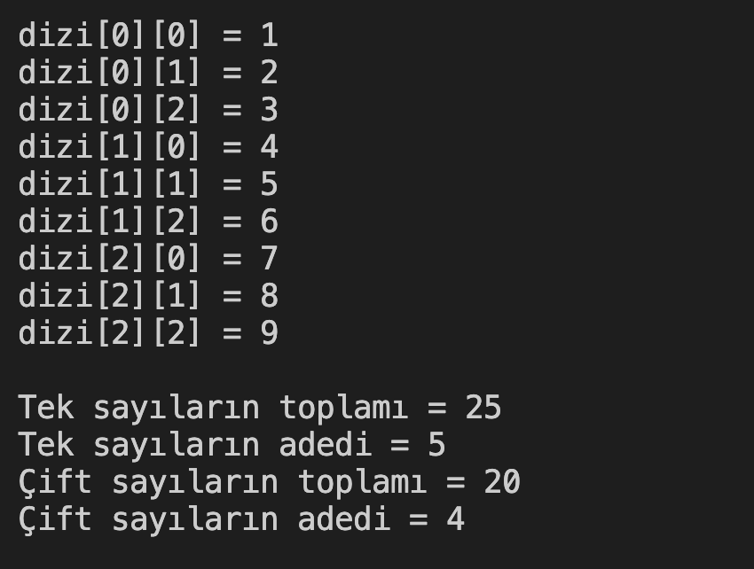

# 14. Soru - Matris İçindeki Tek ve Çift Sayıların Toplanması

**Soru Açıklaması:**
3x3'lük bir matris oluşturulup, girilen sayılar tek ve çift olmak üzere kendi aralarında toplanarak, bu sayıların adetleriyle birlikte ekrana yazdıracak C kodunu yazınız.

**Örnek Ekran Çıktısı:**
 