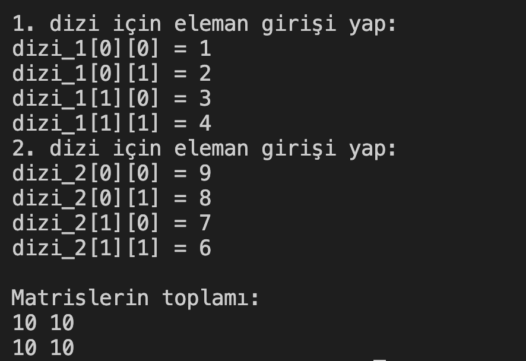

# 15. Soru - Matrislerin Toplanması

**Soru Açıklaması:**
İki 2x2'lik matris oluşturulup, her birine klavyeden sayılar girilecek ve bu iki matrisin toplamını farklı bir matrise atayıp ekrana yazdıracak C kodunu yazınız.

**Örnek Ekran Çıktısı:** 
