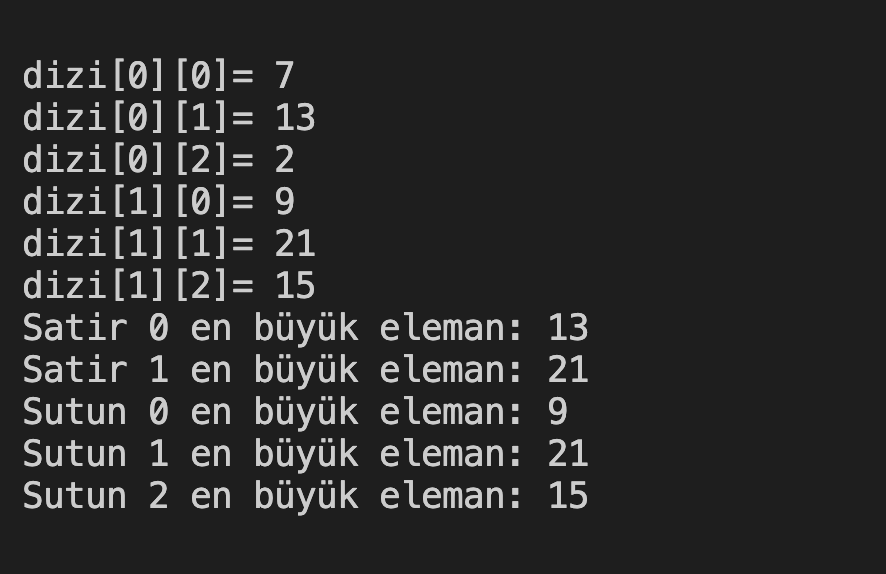

# 16. Soru - 2x3'lük Matrisin En Büyük Sayıları

**Soru Açıklaması:**
2x3'lük bir matris oluşturulup, her satır ve sütundaki en büyük sayıları ekrana yazdıracak C kodunu yazınız.

**Örnek Ekran Çıktısı:** 
