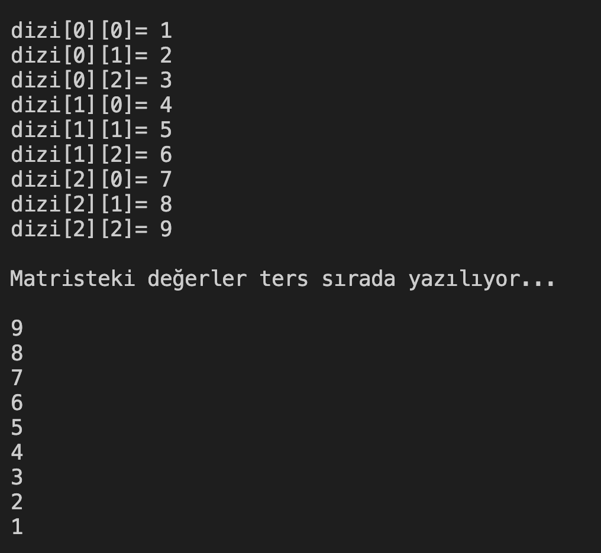

# 17. Soru - Matrisin Ters Sırada Yazdırılması

**Soru Açıklaması:**
3x3'lük bir matris oluşturuluyor ve klavyeden rastgele sayılar matrise giriliyor. Buna göre bu matrisi ters sırada ekrana yazdıran C kodunu yazınız.

**Örnek Ekran Çıktısı:** 
