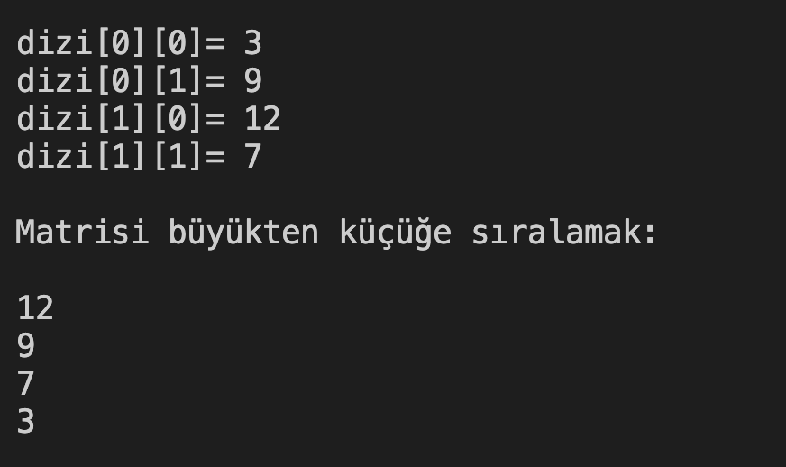

# 18. Soru - 2x2'lik Matrisin Sayılarının Sıralanması

**Soru Açıklaması:**
2'ye 2'lik bir matris oluşturuluyor ve klavyeden rastgele sayılar matrise giriliyor. Girilen sayıları büyükten küçüğe sıralayıp ekrana yazdıran C kodunu yazınız.

**Örnek Ekran Çıktısı:** 
