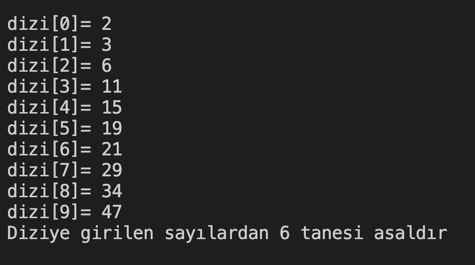

# 19. Soru - Dizideki Asal Sayıları Sayma

**Soru Açıklaması:**
10 elemanlı bir dizi oluşturuluyor ve klavyeden sayılar diziye giriliyor. Diziye girilen sayılardan kaç tanesinin asal olduğunu ekrana yazan fonksiyonun C kodunu yazınız.

**Örnek Ekran Çıktısı:** 
