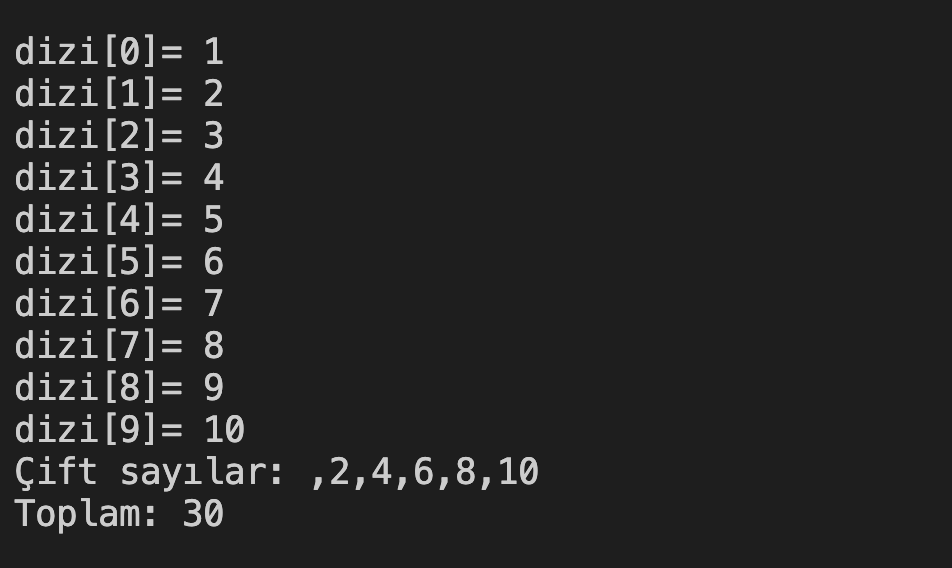

# 20. Soru - Dizideki Çift Sayılar ve Toplamları

**Soru Açıklaması:**
10 elemanlı dizi oluşturuluyor ve rastgele sayılar diziye giriliyor. Girilen değerlerden çift olanları ve çift olanların toplamını ekrana yazan fonksiyonun C kodunu yazınız.

**Örnek Ekran Çıktısı:** 
