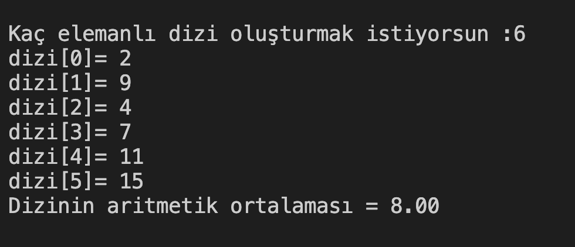

# 21. Soru - N Elemanlı Dizi İçin Aritmetik Ortalama Hesaplama

**Soru Açıklaması:**
N elemanlı bir dizi oluşturuluyor ve diziye rastgele sayılar giriliyor. Girilen sayıların aritmetik ortlamasını hesaplayıp ekrana yazdıran fonksiyonun C kodunu yazınız.

**Örnek Ekran Çıktısı:** 
