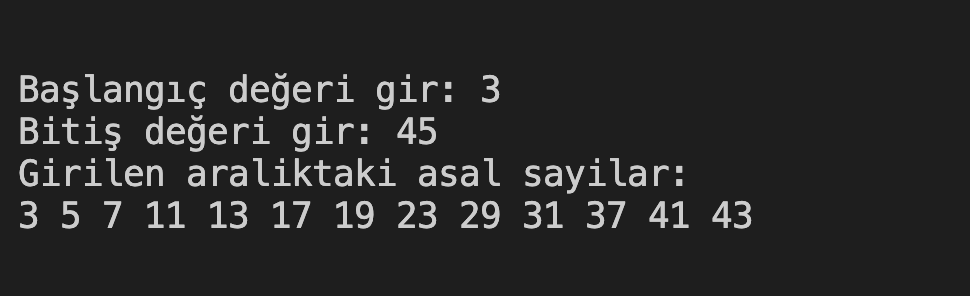

# 22. Soru - Girilen Aralıktaki Asal Sayıları Bulup Yazdırma

**Soru Açıklaması:**
Girilen aralıktaki asal sayıları bulan ve bunları bir diziye kaydedip ekrana yazdıran fonksiyonun C kodunu yazınız.

**Örnek Ekran Çıktısı:** 
