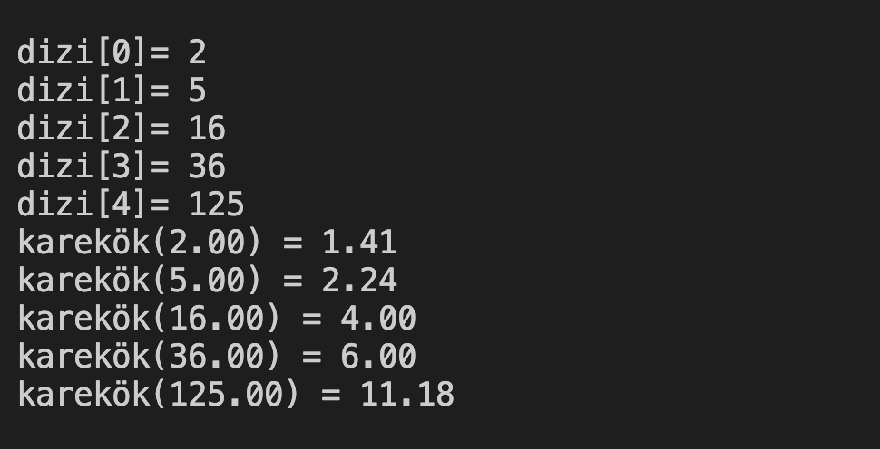

# 23. Soru - Girilen Sayıların Karekökünü Hesaplama ve Yazdırma

**Soru Açıklaması:**
5 elemanlı bir dizi oluşturuluyor ve klavyeden rastgele sayılar diziye giriliyor. 
Girilen sayıların karekökünü hesaplayıp ekrana yazdıran fonksiyonun C kodunu yazınız.

**Örnek Ekran Çıktısı:** 
