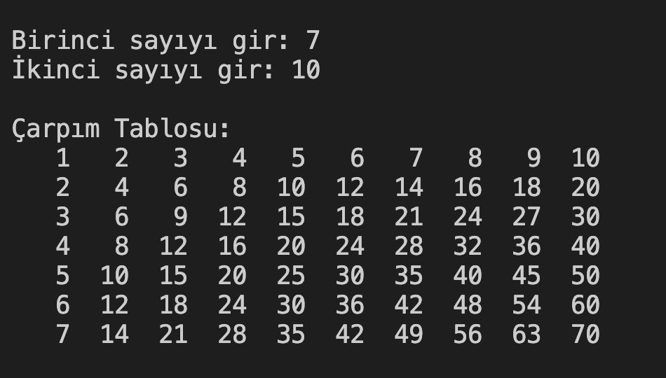

# 24. Soru - Çarpım Tablosu Oluşturma

**Soru Açıklaması:**
Kullanıcıdan alınan iki sayıya göre çarpım tablosu oluşturuluyor ve bu değerler bir diziye kaydediliyor. 
Oluşturulan diziyi ekrana yazdıran C kodunu yazınız.

**Örnek Ekran Çıktısı:** 
