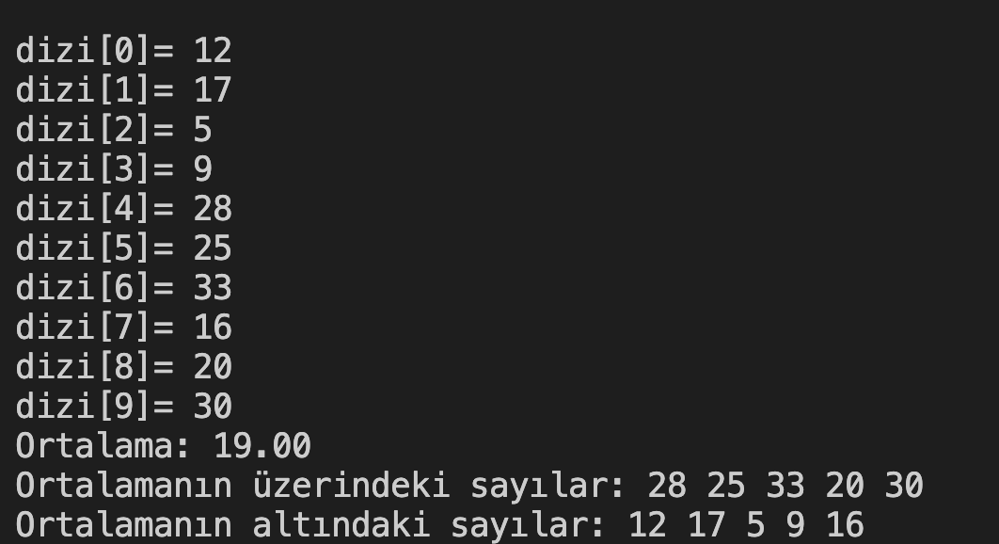

# 25. Soru - Ortalama Değeri Hesaplayarak Sayıları Sınıflandırma

**Soru Açıklaması:**
10 elemanlı bir dizi oluşturuluyor ve klavyeden rastgele sayılar diziye giriliyor.
Girilen sayıların ortalamasını hesaplayıp sayıları ortalamanın altında ve üstünde
olan sayılar şeklinde ekrana yazdıran C kodunu yazınız.

**Örnek Ekran Çıktısı:**
