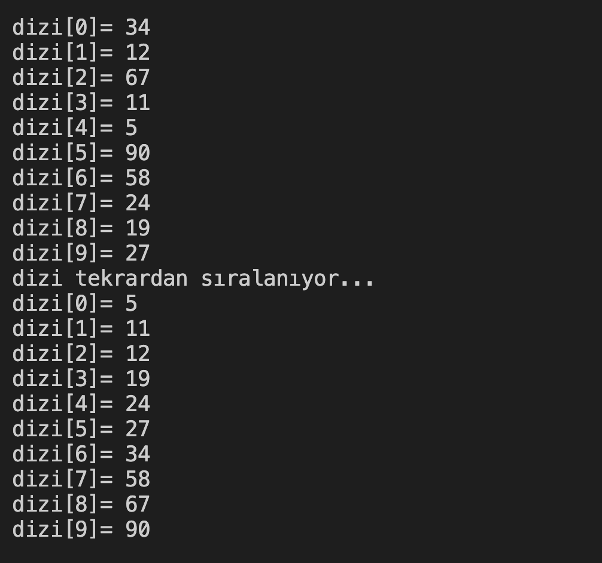

# 26. Soru -  Dizi Elemanlarını Küçükten Büyüğe Sıralama

**Soru Açıklaması:**
10 elemanlı bir dizi oluşturuluyor ve klavyeden rastgele sayılar diziye giriliyor.
Girilen sayıları küçükten büyüğe doğru sıralayıp ekrana yazdıran C kodunu yazınız.

**Örnek Ekran Çıktısı:** 
