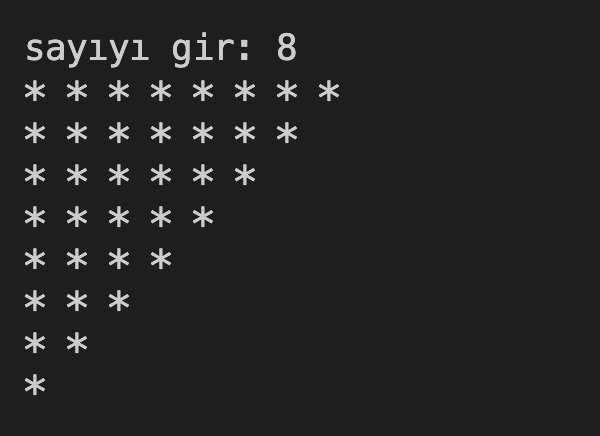

# 27. Soru - Ters Üçgen Dizisi Oluşturma

**Soru Açıklaması:**
Klavyeden rastgele girilen bir sayıya göre ters şekilde üçgen oluşturan ve bir dizi içerisine atarak diziyi ekrana yazdıran C kodunu yazınız.

**Örnek Ekran Çıktısı:** 
