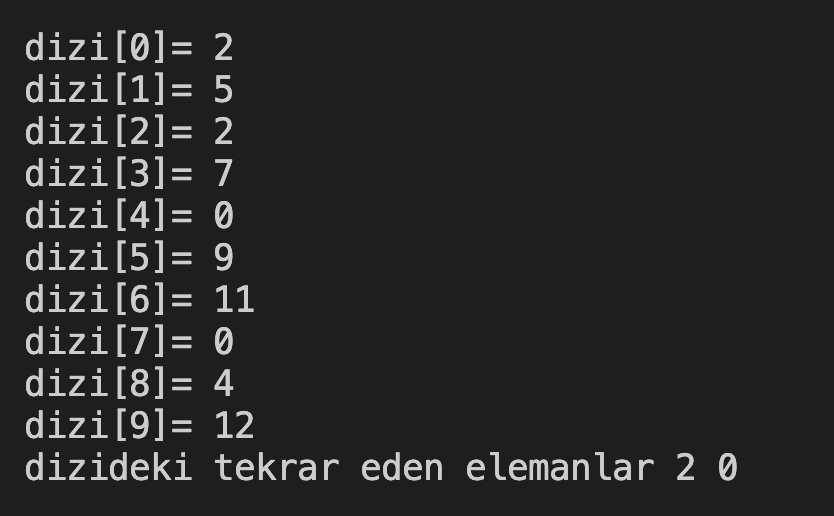

# 28. Soru - Tekrar Eden Sayıları Bulma

**Soru Açıklaması:**
10 elemanlı bir dizi oluşturuluyor ve klavyeden rastgele sayılar diziye giriliyor. Sayılar içerisinde tekrar edenleri bulup ekrana yazdıran C kodunu yazınız.

**Örnek Ekran Çıktısı:** 
