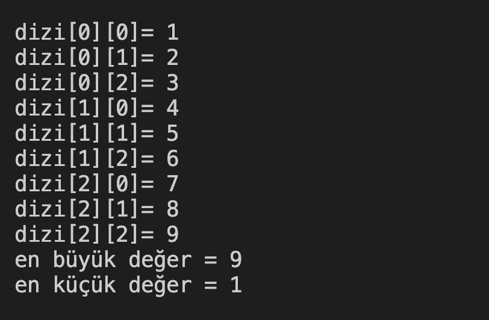

# 29. Soru - Matris İçindeki En Büyük ve En Küçük Sayıyı Bulma

**Soru Açıklaması:**
3'e 3'lük bir matris oluşturuluyor ve klavyeden rastgele sayılar matrise giriliyor. Matris içerisindeki en büyük ve en küçük sayıyı bulup ekrana yazdıran C kodunu yazınız.

**Örnek Ekran Çıktısı:** 
