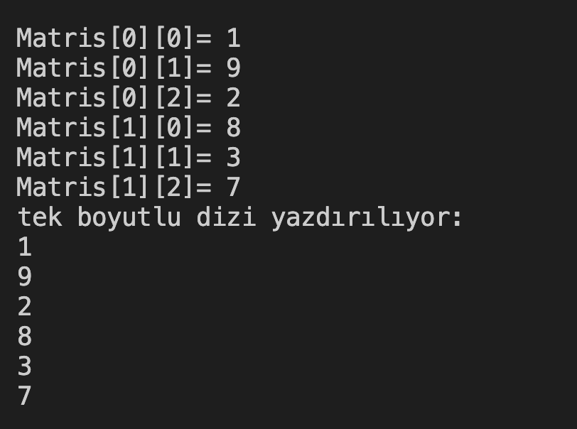

# 30. Soru - 2x3 Matrisini Diziye Dönüştürme

**Soru Açıklaması:**
2'ye 3'lük bir matris oluşturuluyor, klavyeden sayılar matrise giriliyor. Oluşturulan matrisi tek boyutlu bir dizi haline getirip ekrana yazdıran C kodunu yazınız.

**Örnek Ekran Çıktısı:** 
