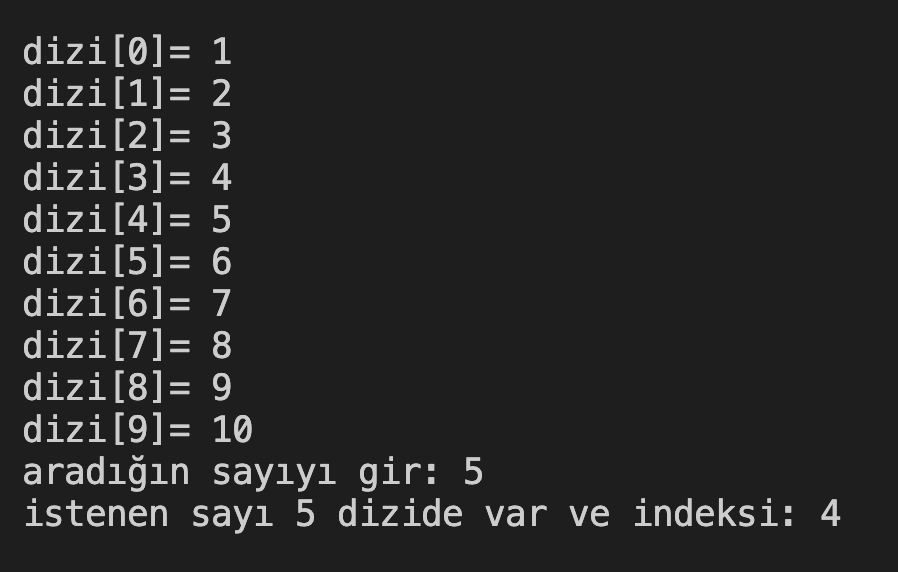
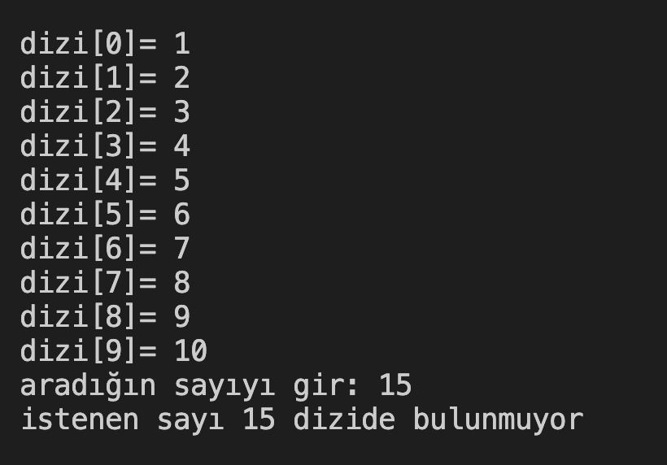

# 31. Soru - Dizide Sayı Arama

**Soru Açıklaması:**
10 elemanlı bir dizi oluşturuluyor ve klavyeden rastgele değerler diziye giriliyor. Dizi içerisinde istenilen sayının olup olmadığını kontrol eden fonksiyonun C kodunu yazınız.

**Örnek Ekran Çıktısı:** 

**Örnek Ekran Çıktısı:** 
