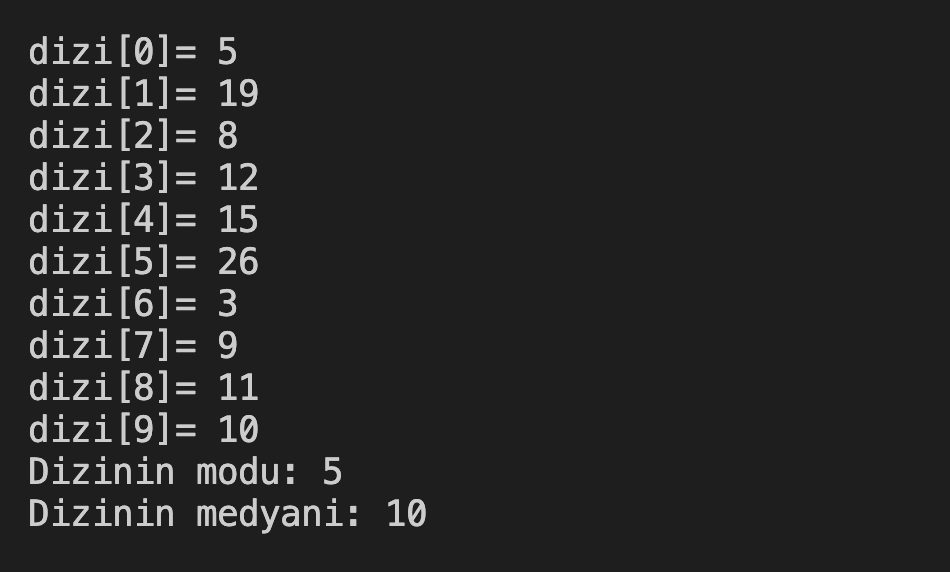

# 32. Soru - Dizinin Mod ve Medyan Değerlerini Hesaplama

**Soru Açıklaması:**
10 elemanlı bir dizi oluşturuluyor ve klavyeden rastgele değerler diziye giriliyor. Dizinin mod ve medyan değerlerini hesaplayıp ekrana yazdıran fonksiyonun C kodunu yazınız.

**Örnek Ekran Çıktısı:** 
