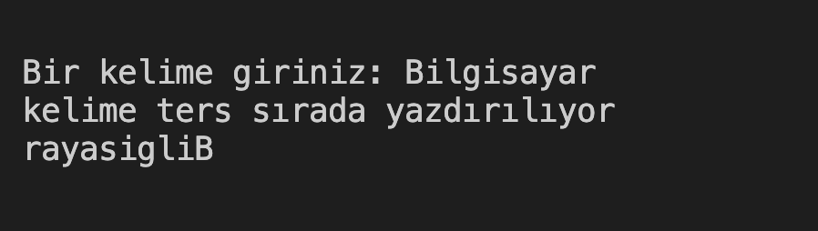

# 33. Soru - Kelimeyi Tersten Yazdırma

**Soru Açıklaması:**
Klavyeden rastgele girilen bir kelime dizi içerisine kaydediliyor. Girilen kelimeyi ters sırada olacak şekilde ekrana yazdıran fonksiyonun C kodunu yazınız.

**Örnek Ekran Çıktısı:** 
