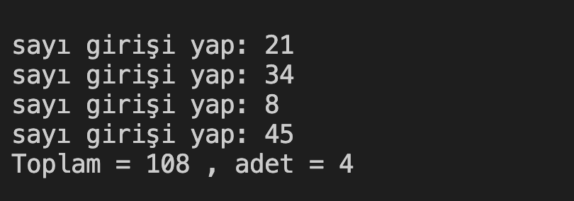

# 5. Soru -  Sayı Toplamı 100'ü Geçince Duran Program

**Soru Açıklaması:**
Girilen sayıların toplamı 100'ü geçtiğinde duracak ve toplam ile sayı adedini yazdıracak C kodunu yazınız.

**Örnek Ekran Çıktısı:** 
