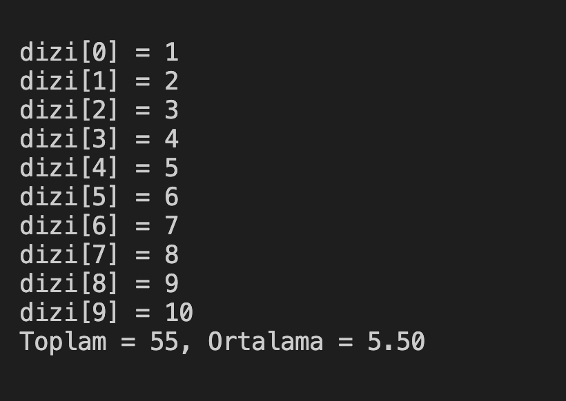

# 8. Soru - 10 Sayı ile Toplam ve Ortalama Hesaplama

**Soru Açıklaması:**
10 elemanlı bir diziye klavyeden rastgele sayılar giriniz.  
Sayıların toplamını ve ortalamasını hesaplayan C kodunu yazınız.

**Örnek Ekran Çıktısı:** 
