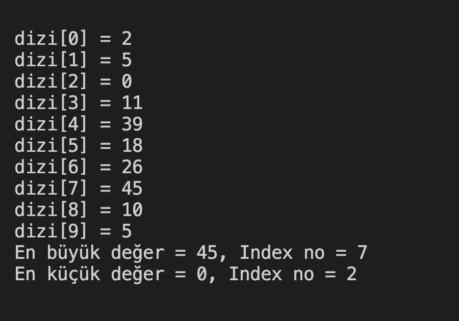

# 9. Soru - 10 Sayıdan En Büyük ve En Küçüğün Değerleri ve İndexleri

**Soru Açıklaması:**
10 elemanlı bir diziye girilen sayılardan, en büyük ve en küçük sayının değerleri ve index numaralarını bulan C kodunu yazınız.

**Örnek Ekran Çıktısı:** 
